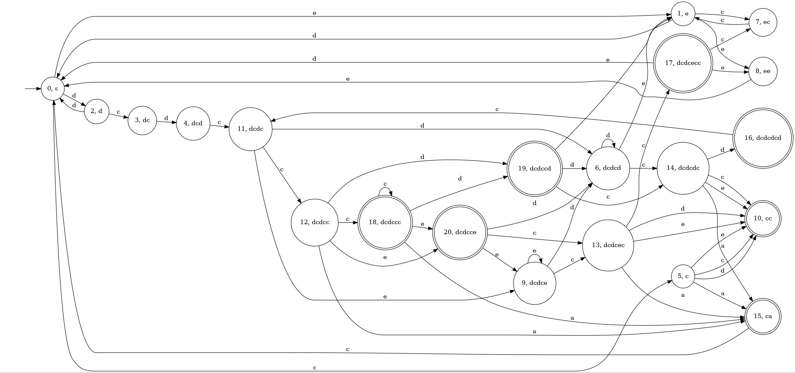
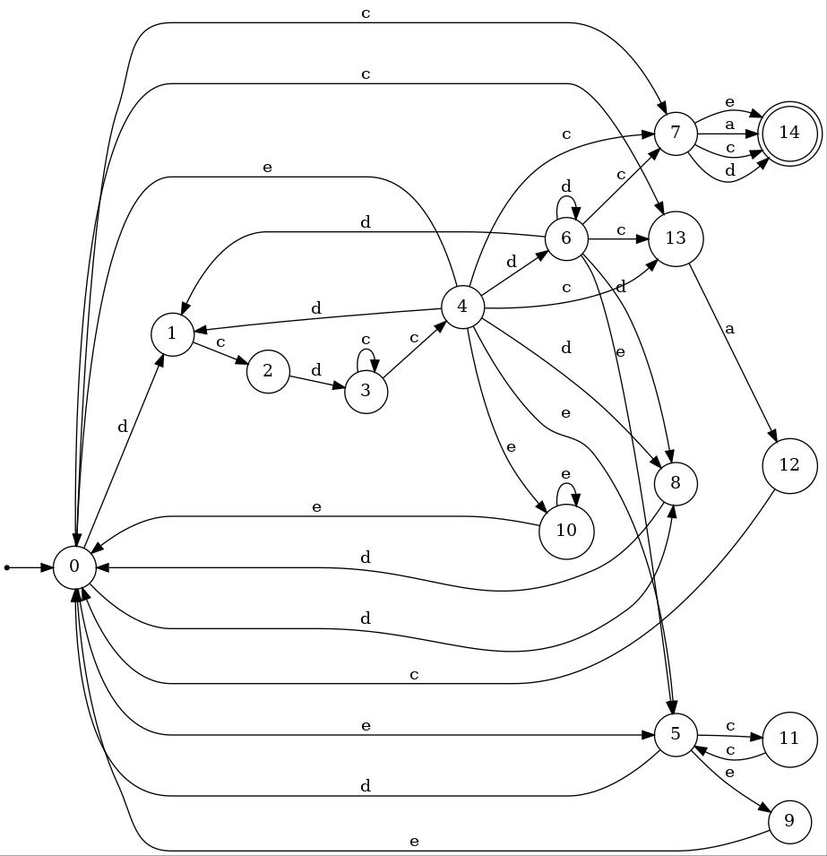
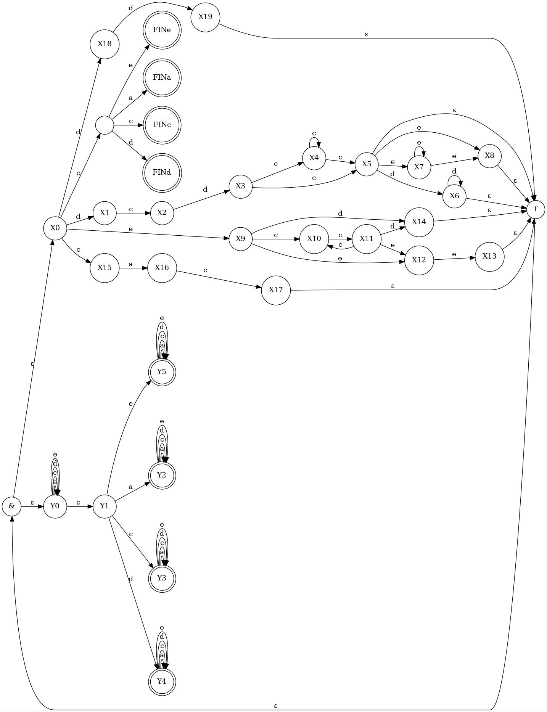

# Регулярное выражение
`(dcdc*c(d*|e*e)|e(cc)*(ee|d)|cac|dd)*c(a|c|d|e)`

# Минимальный ДКА
Минимальный ДКА представлен на картинке dfa.jpg

Обоснование минимальности в виде таблицы:

|   | cc | dcc | ecd | cdca | dccc | $\varepsilon$ | c | ccdcc | cca |
|---|:---:|:--:|:--:|:--:|:--:|:--:|:--:|:--:|:--:|
| $\varepsilon$ | 1 | 0 | 0 | 0 | 0 | 0 | 0 | 0 | 0 | 
| e | 0 | 1 | 0 | 0 | 0 | 0 | 0 | 1 | 0 |
| ec | 0 | 0 | 0 | 1 | 0 | 0 | 0 | 0 | 0 |
| dcdcecc | 0 | 1 | 0 | 0 | 0 | 0 | 0 | 0 | 0 |
| ee | 0 | 0 | 1 | 0 | 0 | 0 | 0 | 0 | 0 | 
| d | 0 | 1 | 0 | 0 | 0 | 0 | 0 | 0 | 0 |
| dc | 0 | 0 | 0 | 0 | 1 | 0 | 0 | 0 | 0 |
| dcd | 0 | 0 | 0 | 1 | 0 | 0 | 0 | 1 | 1 |
| dcdc | 1 | 1 | 1 | 1 | 0 | 0 | 0 | 1 | 1 |
| dcdcdcd | 0 | 0 | 0 | 1 | 0 | 1 | 0 | 1 | 1 |
| dcdccd | 1 | 1 | 0 | 0 | 0 | 1 | 0 | 1 | 1 |
| dcdcd | 1 | 1 | 0 | 0 | 0 | 0 | 0 | 0 | 0 |
| dcdcdc | 0 | 0 | 0 | 0 | 1 | 0 | 1 | 0 | 0 |
| dcdcc | 1 | 1 | 1 | 1 | 0 | 0 | 1 | 1 | 1 |
| dcdccc | 1 | 1 | 1 | 1 | 0 | 1 | 1 | 1 | 1 |
| dcdcce | 1 | 1 | 1 | 0 | 0 | 1 | 0 | 1 | 0 | 
| dcdcec | 0 | 0 | 0 | 1 | 0 | 0 | 1 | 0 | 0 |
| cc | 0 | 0 | 0 | 0 | 0 | 1 | 0 | 0 | 0 |
| dcdce | 1 | 1 | 1 | 0 | 0 | 0 | 0 | 1 | 0|
| c | 0 | 0 | 0 | 0 | 0 | 0 | 1 | 0 | 0 |
| ca | 0 | 0 | 0 | 0 | 0 | 1 | 0 | 0 | 1 |

# Возможно малый НКА
Возможно малый НКА представлен на картинке minNFA.jpg

Обоснование в виде таблицы:

|   | cc | a | cdccc | dca | $\varepsilon$ | dccc | cdddca | eecc | ccc |
|---|:---:|:--:|:--:|:--:|:--:|:--:|:--:|:--:|:--:|
| $\varepsilon$ | + | . | . | . | . | . | . | . | . | 
| c | - | + | . | . | . | . | . | . | . |
| d | - | - | + | . | . | . | . | . | . |
| e | - | - | - | + | . | . | . | . | . |
| ca | - | - | - | - | + | . | . | . | . | 
| dc | - | - | - | - | - | + | . | . | . |
| ec | - | - | - | - | - | - | + | . | . |
| dcdce | - | - | - | - | - | - | - | + | . |
| dcd | - | - | - | - | - | - | - | - | + |

# Возможно малый ПКА

(dcdc*c(d*|e*e)|e(cc)*(ee|d)|cac|dd)*c(a|c|d|e)
Заметим, что исходная регулярка не допускает строк, которые содержат в качестве подстроки 
"accccc" и "eccccc". Объяснение: заметим, что 2 и более буквы "c" подряд могут идти в следующих ситуациях: 
- `dcdc*c(d*|e*e)`, если в качестве `d*` взять пустую строку.
Но тут перед c*c идёт буква "d" .
-`e(cc)*(ee|d)` (из-за звездочки); 
Но тогда длина (cc)^n будет четной
- если сконкатенировать `caс` с `c(a|c|d|e)`. 
Но тут получится максимум подстрока "accc", а мы говорим про "accccc".

Возможно малый ПКА представлен на картинке pka.jpg

